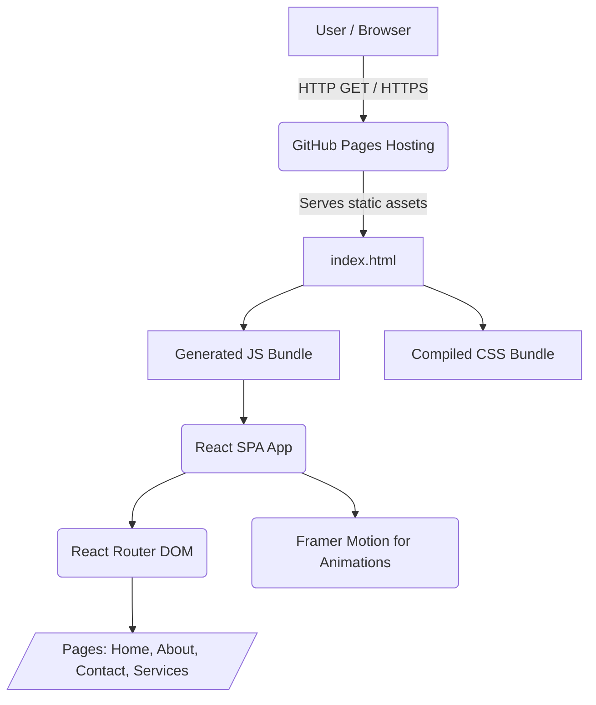
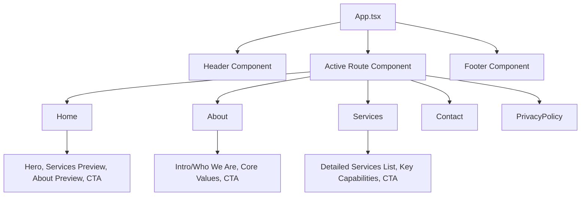
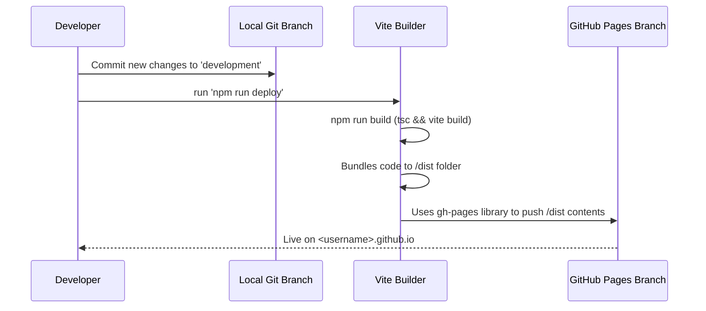
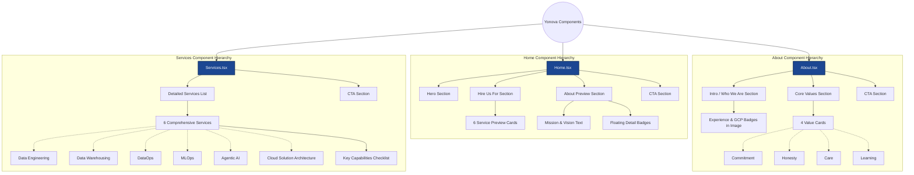

# Yonova Technologies Website - Technical Wiki

This document provides a comprehensive overview of the Yonova Technologies website application, including workflow, data flow, architecture, and technology stack.

## Architecture Diagram

The application is a purely front-end, single-page application (SPA). There is no active backend or database, and all content delivery happens directly from static files hosted on GitHub Pages.

## Data Flow Diagram

Since the application does not communicate with off-site APIs or databases, the data flow primarily focuses on static state and component prop drilling.

**Note**: State management is handled primarily with local React hooks (`useState`, `useEffect`). Any data shown on the pages (e.g., Services list, Team Member info) is either hardcoded inside the components or defined as static TypeScript objects locally within those files. For this specific agency/portfolio-style site, static structured data completely suffices.

## Workflow & Development Process 

### 1. Technology Stack
* **Framework:** React 19 Function Components
* **Build Tool:** Vite 
* **Language:** TypeScript
* **Styling:** Vanilla CSS
* **Animations:** Framer Motion
* **Icons:** Lucide React
* **Routing:** React Router DOM v7

### 2. Development Workflow

1. **Install dependencies:** `npm install`
2. **Local Development Server:** `npm run dev` kicks off Vite's dev server which includes hot module replacement (HMR).
3. **Adding New Pages:** 
   - Create a `.tsx` file in `src/pages/`.
   - Add the specific route to `<Routes>` within `src/App.tsx`.
   - Update navigation links in `src/components/Header.tsx`.
   - Update any necessary CSS in `<Page>.css`.

### 3. Deployment Workflow

The deployment relies comprehensively on the `gh-pages` branch deployment strategy.

* **Build Phase (`npm run build`):** Validates TypeScript mappings using `tsc -b` and bundles out minified generic HTML, CSS, and JS packages into the `./dist` folder.
* **Publish Phase (`npm run deploy`):** A pre-deploy step inherently invokes build. Following a successful build, the `./dist` payload is committed directly to the `gh-pages` branch via the `gh-pages` NPM package. This process bypasses the main source tree entirely and places the built source in the appropriate branch automatically configured for hosting.

## Routing Schema
* `/` - **Home**: Overview of the agency and core hook.
* `/about` - **About**: Details agency structure, history, and people.
* `/services` - **Services**: Highlights what the agency builds and offers.
* `/contact` - **Contact**: Basic layout for get-in-touch interactions.
* `/privacy-policy` - **Privacy Policy**: Required business compliance details.

## Component Diagram

